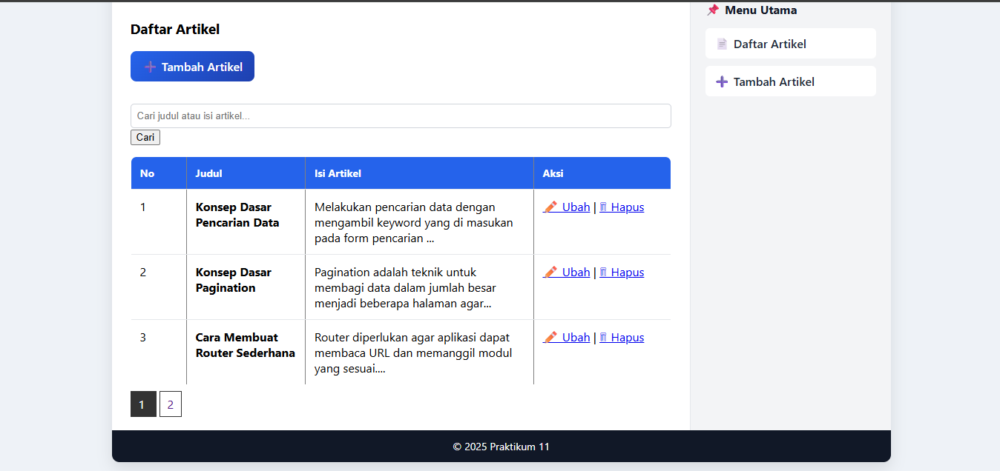
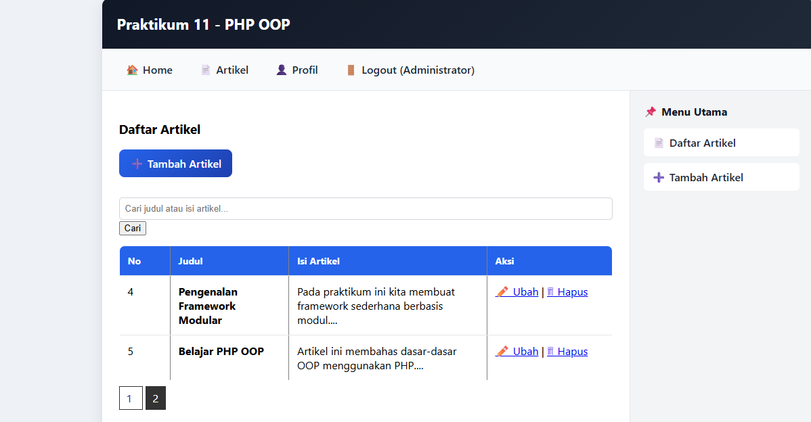
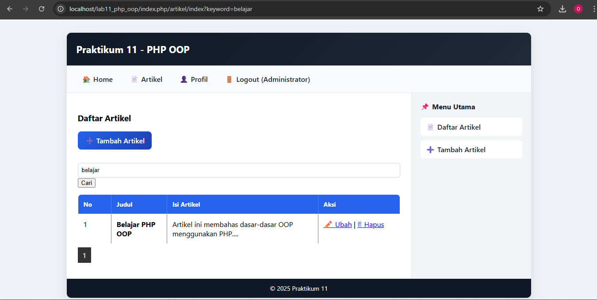

# Praktikum 13 & 14: PHP OOP – Pagination Data & Pencarian Data (Search)

Nama: Sayyid Sulthan Abyan

NIM: 312410496

Kelas: TI.24.A.5

---

# Praktikum 13: PHP OOP – Pagination Data
## Tujuan Praktikum
Praktikum 13 bertujuan untuk:
1. Memahami konsep pagination (pembagian halaman data)
2. Membatasi jumlah data yang ditampilkan per halaman
3. Menggunakan LIMIT dan OFFSET pada query MySQL
4. Meningkatkan performa dan kenyamanan tampilan data

---

## Struktur Folder
```pgsql
lab11_php_oop/
├── .htaccess
├── config.php
├── index.php
├── class/
│   ├── Database.php
│   └── Form.php
├── module/
│   ├── home/
│   │   └── index.php
│   └── artikel/
│       ├── index.php
│       ├── tambah.php
│       └── ubah.php
└── template/
    ├── header.php
    └── footer.php
```

disini saya masih menggunakan struktur folder dar praktikum sebelum nya

---

## Konsep Dasar Pagination
Pagination adalah teknik untuk membagi data dalam jumlah besar menjadi beberapa halaman agar:
- Tampilan lebih rapi
- Akses data lebih cepat
- Penggunaan memori lebih efisien

Pagination menggunakan perintah SQL:
- `LIMIT`
- `OFFSET`

---

## Implementasi Pagination

### 1. Menentukan Jumlah Data per Halaman
```php
$per_page = 3;
$page = isset($_GET['page']) ? (int)$_GET['page'] : 1;
$start = ($page - 1) * $per_page;
```

disini saya membatasi 3 data untuk setiap halaman

---

### 2. Query Data dengan LIMIT
```php
$sql = "SELECT * FROM artikel LIMIT $start, $per_page";
$data = $db->query($sql);
```

Query ini menampilkan data sesuai halaman aktif.

---

### 3. Menghitung Jumlah Halaman
```php
$total = $db->query("SELECT COUNT(*) AS total FROM artikel")->fetch_assoc();
$total_page = ceil($total['total'] / $per_page);
```

---

### 4. Navigasi Pagination
```php
for ($i = 1; $i <= $total_page; $i++) {
    echo "<a href='?page=$i'>$i</a> ";
}
```

Navigasi ini digunakan untuk berpindah antar halaman data.

---

## Hasil Praktikum 13
- Data artikel terbagi menjadi beberapa halaman
- Setiap halaman hanya menampilkan data sesuai batas yang ditentukan
- Navigasi pagination berfungsi dengan baik

**Hasil Output:**

halaman 1



halaman 2



---

## Kesimpulan Praktikum 13
1. Dari praktikum ini dapat disimpulkan bahwa:
2. Pagination membantu mengelola data dalam jumlah besar
3. LIMIT dan OFFSET efektif untuk membatasi data
4. Tampilan data menjadi lebih rapi dan terstruktur
5. Penggunaan pagination meningkatkan performa aplikasi

---

# Praktikum 14: PHP OOP – Pencarian Data (Search)
## Tujuan Praktikum

Praktikum 14 bertujuan untuk:
- Memahami konsep pencarian data
- Menggunakan klausa WHERE pada query SQLMengimplementasikan pencarian menggunakan LIKE
- Menggabungkan fitur search dengan data tabel

---

## Konsep Dasar Pencarian Data

Pencarian data dilakukan dengan menambahkan filter pada query SQL menggunakan:
- `WHERE`
- `LIKE`

Contoh query dasar:
```sql
SELECT * FROM artikel;
```

Query dengan filter:
```sql
SELECT * FROM artikel WHERE judul LIKE '%keyword%';
```

---

## Implementasi Pencarian Data
### 1. Membuat Form Pencarian

Form pencarian diletakkan di halaman daftar artikel.
```php
<form method="get">
    <input type="text" name="keyword" placeholder="Cari artikel...">
    <button type="submit">Cari</button>
</form>
```

---

### 2. Mengambil Keyword Pencarian
```php
$keyword = isset($_GET['keyword']) ? $_GET['keyword'] : '';
```

---

### 3. Query dengan Filter Pencarian
```php
$sql = "SELECT * FROM artikel 
        WHERE judul LIKE '%$keyword%' 
        OR isi LIKE '%$keyword%'";
$data = $db->query($sql);
```

Query ini akan menampilkan artikel berdasarkan judul atau isi yang sesuai dengan kata kunci.

---

## Hasil Praktikum 14
- User dapat mencari artikel berdasarkan kata kunci
- Data yang ditampilkan sesuai dengan hasil pencarian
- Fitur pencarian berjalan dengan baik

**Hasil Output:**

mencari artikel denga keyword "belajar"



---

## Kesimpulan Praktikum 14
Dari praktikum ini dapat disimpulkan bahwa:
1. Pencarian data memudahkan pengguna menemukan informasi
2. Klausa WHERE dan LIKE efektif untuk filtering data
3. Fitur search meningkatkan usability aplikasi
4. Pencarian dapat dikombinasikan dengan pagination

---

Universitas Pelita Bangsa – 2025
